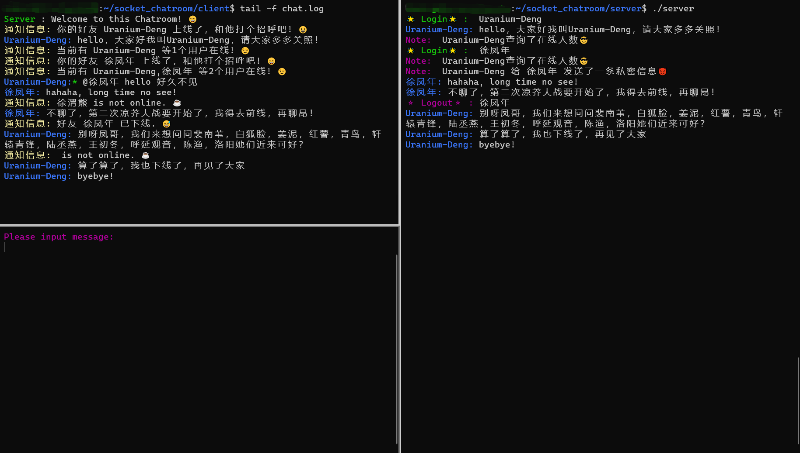

# socket_chatroom
a simple online chatroom based on internet socket programming (100% implemented by C)

---

### 1. Usage

&emsp;&emsp;git clone下载socket_chatroom项目文件夹后，在server.cfg配置文件中编辑server端的IP地址以及Port端口号 `vim ./server/server.cfg`将其修改为自己公网服务器的IP地址（没有公网服务器，用普通私网计算机也行，只要保证你能连接到server端即可），同理修改`client`端的port端口号。

&emsp;&emsp;之后在server端和client端分别`./G`编译（估计只能在linux系统下编译成功，windows和Mac没试过，有人会问，你为啥不写个CMakeLists.txt，这样不管什么平台都能很好的兼容啊！别问，问就是现在小编还不太会写CMakeLists.txt (理不直气也壮.jpg)，以后有时间会学习的），之后`./server`启动服务端，`./client`启动客户端，./client启动客户端后当前界面会变为聊天信息输入界面，需要再开一个终端，输入`tail -f chat.log`，即可看到聊天信息。

---

### 2. 聊天界面

&emsp;&emsp;上图分为三部分，左上角部分为client端收到的信息，左下角为client端输入发送信息的位置，右侧为服务器端的输出内容。

----

### 3. 系统介绍

&emsp;&emsp;本系统基于socket网络套接字进行网络编程，实现了一个简易的在线聊天室。

&emsp;&emsp;聊天系统为Client/Server架构（TCP协议）。client与server连接成功实现登录后，一直做的就是两件事情：(1) 消息的发送；(2) 消息的接收，本系统通过双进程实现，其中子进程负责消息发送，父进程负责消息接收。子进程收到服务器转发的消息后，将消息保存到chat.log文件 (其实是printf()输出到标准输出，只不过将标准输出的内容重定向到chat.log文件而已)，因此client端查看接收信息需要`tail -f chat.log`。父进程在发送消息时，采用`scanf("%[^\n]s", msg);`读取终端输入，遇见换行符后发送该消息，在发送消息前，父进程会根据发送消息的内容确定该消息的类型，例如：若输入信息第一个字符是`@`，说明这是一条`@`某人的私聊信息，若输入信息为`#`，说明用户要查询当前聊天室在线的总人数，client端据此设置发送消息的`flag`位，告知server端用户的需求。

​		server端的工作也很简单，就是两件事：(1) 维护登录用户的信息，包括该用户的姓名(主键)、负责和该用户通信的sockfd套接字文件描述符、该用户是否在线标志位、以及负责和该用户通信的线程编号 pthread_t tid，其实就是维护一个结构体数组；(2) 消息的接收和转发，server 同时接收和转发各个用户的消息。server端采用了多线程进行工作。

​		目前server端采用的只是最基础的多线程编程，即来一个用户，为该用户分配一个线程，当该用户退出时，则销毁该线程，这样做显然是不好的，频繁的进行线程的创建和销毁会消耗系统时空资源，因此可改用`线程池`实现（有待后续实现）除了采用线程池方法，还可以采用IO多路复用，即 (select or poll or epoll + 非阻塞IO实现)。当然这些都有待后续实现。

